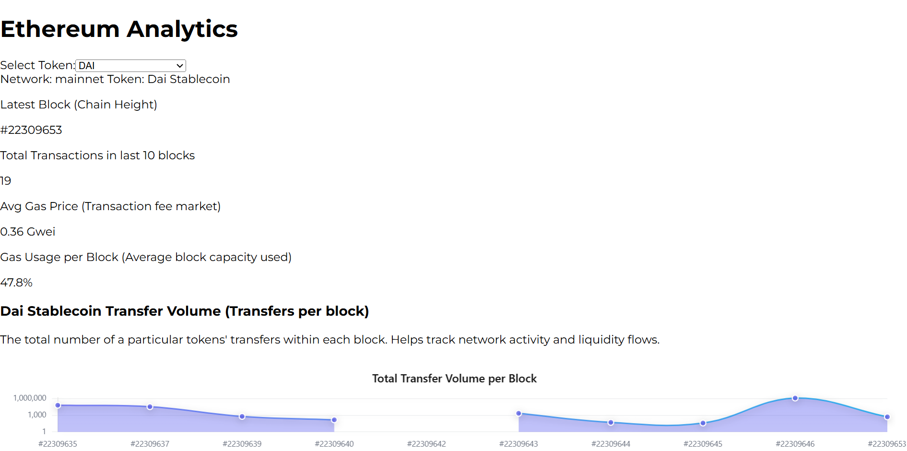
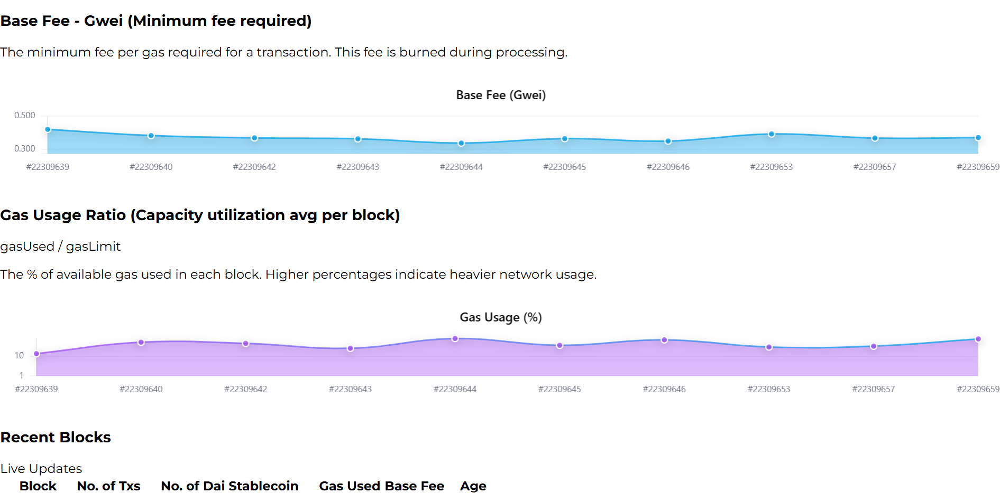
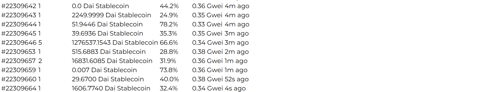

# ETH Token Info Dashboard

**ETH Token Info Dashboard** is a real-time analytics tool for Ethereum. It allows users to monitor and visualize critical network metrics such as **ERC20 token transfer volume**, **base fee** (EIP-1559), and **gas usage ratio**. Built with **Next.js**, **React**, **Ethers.js**, and **Framer Motion**, this dashboard provides real-time Ethereum data, helping developers and token holders track token activities, transaction costs, and network utilization.

<p align="center" style="margin:0;">
  
  
  
</p>


## Skills Demonstrated:

- **Web Development:** Proficient in building dynamic, real-time applications with modern web technologies, including **Next.js**, **React**, and **Framer Motion** for smooth animations.
- **Blockchain Integration:** Expertise in integrating blockchain data with **Ethers.js** and **Alchemy API** to fetch real-time Ethereum data for ERC20 tokens and blockchain metrics.
- **Smart Contract Interaction:** Experienced in interacting with **Ethereum** smart contracts to fetch token data, such as name, decimals, and transaction logs, leveraging **Ethers.js** for smart contract interactions.
- **Data Visualization:** Proficient in creating dynamic and responsive charts and graphs using **Chart.js** to visualize Ethereum network metrics such as gas usage, transfer volumes, and base fees.
- **State Management:** Implemented state management with **React Hooks** and **useState**, **useEffect** for handling Ethereum network updates and dynamic token selection.
- **Real-time Data Handling:** Implemented real-time updates with **WebSocket** connections to monitor blockchain changes and reflect them instantly in the application.

## Overview

- **ERC20 Token Tracking:**  
  Visualize **ERC20 token transfer volume** over the latest 10 blocks.
- **Base Fee Visualization:**  
  Monitor the **base fee** for each block (EIP-1559).
- **Gas Usage Ratio:**  
  Track the **gas usage ratio** (used/limit) for each block, showing network congestion.
- **Real-Time Data:**  
  Displays data in real-time from the **Ethereum network** using **Alchemy API**.
- **Token Selection:**  
  Select any popular ERC20 token (DAI, USDC, USDT, WETH, etc.) to monitor transfer activity and performance.

## Key Features

1. **ERC20 Token Transfer Volume**  
   Track the **total transfer volume** for an ERC20 token over the last 10 blocks.

2. **Base Fee Tracking (EIP-1559)**  
   Visualize **gas base fee** per block and understand the cost of transactions.

3. **Gas Usage Ratio**  
   Measure the **gas usage percentage** per block to assess network congestion.

4. **Real-Time Ethereum Data**  
   The dashboard pulls real-time data from Ethereum using **Alchemy** and updates instantly.

5. **Token Selection**  
   Select different ERC20 tokens like DAI, USDC, WETH, and others. The token data is fetched and displayed dynamically.

## Live Demo & Preview

- **Vercel Deployment:** [https://my-dashboard-dapp.vercel.app/](https://my-dashboard-dapp.vercel.app/)

## Deployed Contract Addresses (Mainnet)

- **DAI Token Address:** `0x6B175474E89094C44Da98b954EedeAC495271d0F`  
- **USDC Token Address:** `0xa0b86991c6218b36c1d19d4a2e9eb0ce3606eb48`  
- **USDT Token Address:** `0xdAC17F958D2ee523a2206206994597C13D831ec7`  

*Note: These addresses are for the Sepolia testnet. Replace them with Mainnet addresses when deploying on the Ethereum Mainnet.*

## How It Works

1. **Wallet Connection:**  
   - Connect your **MetaMask** wallet. The dashboard automatically switches to the **Sepolia network** if required.

2. **Token Selection:**  
   - Choose any ERC20 token (like DAI, USDC, USDT) to monitor.

3. **Monitor Transfer Volume:**  
   - See the **total volume** of the selected token's transfers per block.

4. **Track Gas Fees:**  
   - Observe the **base fee** for transactions and how network capacity is utilized by checking the **gas usage ratio** per block.

5. **Real-Time Updates:**  
   - Data is updated instantly on new blocks, giving you real-time insights into the Ethereum network.

## Setup & Deployment Instructions

### 1. Clone the Repository

```bash
git clone https://github.com/devdiner/eth-token-info-dashboard.git
cd eth-token-info-dashboard
```

### 2. Install Dependencies

For the frontend:

```bash
cd nextjs
npm install
```

### 3. Set Environment Variables

Create or update your `.env` file in `nextjs` with the following:

```
NEXT_PUBLIC_ALCHEMY_API_KEY=yourAlchemyApiKey //mainnet's
```

### 4. Run the Application

From the `nextjs` folder, run:

```bash
npm run dev
```

The application should now be running at [http://localhost:3000](http://localhost:3000).

## Additional Considerations

- **Sufficient ETH:**  
  Ensure your MetaMask wallet has enough **Sepolia ETH** for gas fees.

- **Real-Time Data:**  
  The dashboard fetches the latest Ethereum data for ERC20 token transfers, base fee, and gas usage from **Alchemy**.

- **MetaMask Requirement:**  
  The dashboard requires **MetaMask** for wallet connection. Other wallets, like **Phantom**, are not supported at the moment.

## License

MIT License
