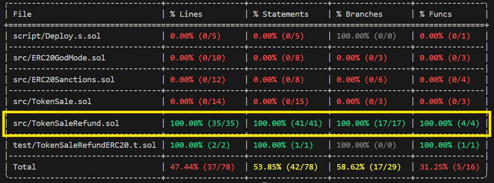

# **TokenSaleRefundERC20 – Foundry Testing Report**

This document summarizes our **Partial Refund ERC20** contract (`TokenSaleRefundERC20`) testing efforts using **Foundry**, achieving **100%** line, statement, branch, and function coverage.
  
  
  

---

## **1. Overview**

- **Goal:** Provide an ERC20 token sale with partial refunds:
  - **Buy Rate:** 1 ETH → 1000 tokens.
  - **Sell Rate:** 0.5 ETH → 1000 tokens.
  - **Max Supply:** 1,000,000 tokens.
  - **Reuse** any tokens held by the contract before minting new ones.
- **Contract Name:** `TokenSaleRefundERC20`
- **Testing Framework:** [Foundry](https://book.getfoundry.sh/)
- **Key Features:**
  1. **Fallback** purchase (`receive()` calls `buyTokens()`).
  2. **Refund Mechanism** (`sellBack()`) with required allowance.
  3. **Ownership** for `withdrawETH()`.

---

## **2. Test Suite & Commands**

**Test File:** `TokenSaleRefundERC20.t.sol`  
We run tests and generate coverage with:

```bash
forge build
forge test -vvvv
forge coverage -vvv
```

### **Environment Setup**
- **Install Foundry:**
  ```bash
  curl -L https://foundry.paradigm.xyz | bash
  foundryup
  ```
- **Compile & Test:**
  ```bash
  forge build
  forge test -vvvv
  forge coverage
  ```

---

## 3. Test Coverage & Scenarios

After thorough iteration, **100%** line, statement, branch, and function coverage is achieved. The table below lists **all 19 tests** ensuring robust coverage of both success paths and revert scenarios:

1. **testBuyTokensBelowMinimum()**  
   - **Scenario:** Reverts if `msg.value < 1 ETH`.  
   - **Error:** `InsufficientEtherSent`.

2. **testBuyTokensContractHasTokens()**  
   - **Scenario:** Contract already holds tokens from prior sells.  
   - **Checks:** Reuse stored tokens before minting new.

3. **testBuyTokensDirectFunctionCall()**  
   - **Scenario:** Calls `buyTokens()` directly with sufficient ETH.  
   - **Checks:** The user receives correct token amount.

4. **testBuyTokensExactlyMaxSupply()**  
   - **Scenario:** Buys exactly 1,000,000 tokens (1,000 ETH).  
   - **Checks:** Reaches `MAX_SUPPLY` without revert.

5. **testBuyTokensExceedsMaxSupply()**  
   - **Scenario:** Attempt to mint beyond `MAX_SUPPLY`.  
   - **Checks:** Must revert with `ExceedsMaxSupply`.

6. **testBuyTokensFullyCoveredByStoredTokens()**  
   - **Scenario:** Purchase is **fully** satisfied by contract-held tokens (no new mint).  
   - **Checks:** Zero leftover tokens after the buy.

7. **testBuyTokensNoEtherSent()**  
   - **Scenario:** `msg.value == 0`.  
   - **Error:** `NoEtherSent`.

8. **testBuyTokensUsesStoredTokensFully()**  
   - **Scenario:** Purchase is **partially** covered by stored tokens, then rest minted.  
   - **Checks:** Remaining store tokens, minted tokens.

9. **testBuyTokensWithReceiveFallback()**  
   - **Scenario:** Sending ETH directly triggers `receive()` => calls `buyTokens()`.  
   - **Checks:** Fallback logic correctness.

10. **testContractSelfBuy()**  
    - **Scenario:** Contract calls itself to buy tokens, remaining **under** `MAX_SUPPLY`.  
    - **Checks:** `_mint(address(this), tokensToBuy)` path.

11. **testContractSelfBuyExceedsMaxSupply()**  
    - **Scenario:** Contract calls itself, but total supply would exceed `MAX_SUPPLY`.  
    - **Checks:** Reverts with the require `Exceeds max supply` in self-buy path.

12. **testContractSelfBuyExceedsMaxSupply_StringRevert()**  
    - **Scenario:** Same as above but verifying the **string** revert `"Exceeds max supply"`.  
    - **Checks:** String-based revert for the self-buy fail branch.

13. **testSellBackCallFailure()**  
    - **Scenario:** Selling tokens back to a user whose fallback reverts on receiving ETH.  
    - **Checks:** `ETH transfer failed` revert.

14. **testSellBackHappyPath()**  
    - **Scenario:** User sells 1000 tokens => gets 0.5 ETH.  
    - **Checks:** Correct refund amount, tokens end up in contract.

15. **testSellBackIncorrectAllowance()**  
    - **Scenario:** User tries to sell tokens without calling `approve()`.  
    - **Checks:** Must revert with `"Incorrect allowance"`.

16. **testSellBackNotEnoughEthInContract()**  
    - **Scenario:** Contract lacks ETH to fulfill refund (owner withdrew funds).  
    - **Checks:** Reverts with `NotEnoughEthInContract`.

17. **testSellBackPartialAllowanceReduction()**  
    - **Scenario:** User approves > needed, sells partial.  
    - **Checks:** Remaining allowance is adjusted accordingly.

18. **testWithdrawETH()**  
    - **Scenario:** Owner withdraws the contract’s ETH.  
    - **Checks:** Transfer success, contract balance is zero afterward.

19. **testWithdrawETHCallFailure()**  
    - **Scenario:** Owner is a contract that reverts on receiving ETH.  
    - **Checks:** Must revert with `WithdrawFailed`.

**Result:** All 19 tests pass successfully, confirming every critical path—buying (including fallback), partial refunds, allowance logic, maximum supply checks, self-buy success/fail, and withdrawal—are fully tested, yielding **100%** coverage.

---

## **4. Notable Tests (Examples)**

- **`testContractSelfBuy()`**  
  *Scenario:* The contract calls itself (via `receive()`) to buy tokens, verifying it can mint to its own balance if under max supply.

- **`testContractSelfBuyExceedsMaxSupply_StringRevert()`**  
  *Scenario:* The contract calls itself with enough ETH to exceed `MAX_SUPPLY`, ensuring a revert with `"Exceeds max supply"` string.

- **`testSellBackPartialAllowanceReduction()`**  
  *Scenario:* A user (Alice) approves more tokens than they sell (e.g. approves 2000 but sells 1000). After selling, the leftover allowance is 1000.

---

## **5. Final Results**

- **All** tests passed with **100%** coverage:
  ```plaintext
  src/TokenSaleRefund.sol | 100.00% (lines) | 100.00% (statements) | 100.00% (branches) | 100.00% (funcs)
  ```
- **Key Observations**:
  1. **Robust** partial-refund logic with correct revert paths.
  2. **Self-buy** success and failure thoroughly tested.
  3. **Approval** edge cases (partial allowance usage) now fully covered.

---

## **6. Conclusion & Next Steps**

- **Confidence**: The partial refund mechanics, buy/mint logic, and max supply checks are validated.
- **Possible Future Enhancements**:
  - **Mutation testing** (e.g. with [SuMo-SOlidity-MUtator](https://github.com/MorenaBarboni/SuMo-SOlidity-MUtator)).
  - **Additional roles** or advanced permission logic if needed.
- **Deployment**: Ensure the contract has enough ETH for refunds; monitor supply usage.

**With 100% coverage and a broad set of scenario tests, this contract is well-prepared for production.**